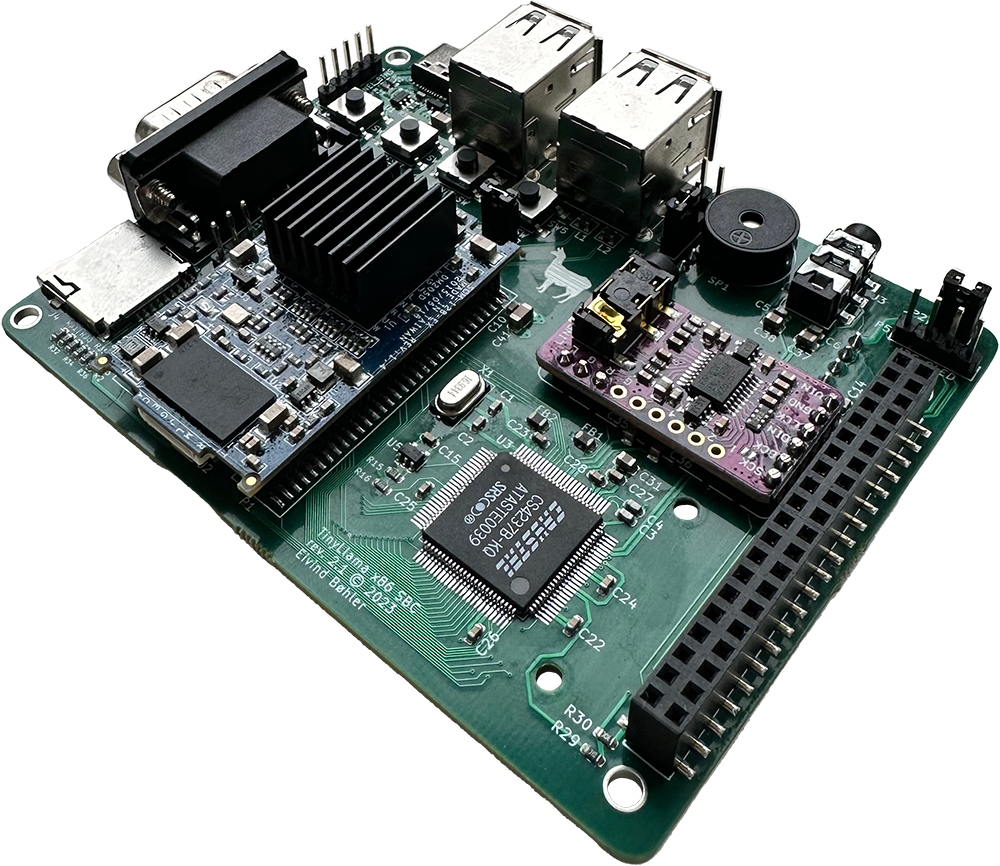
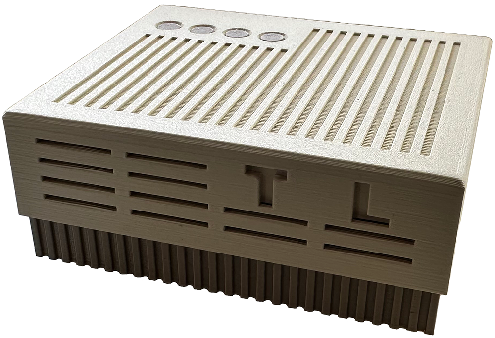
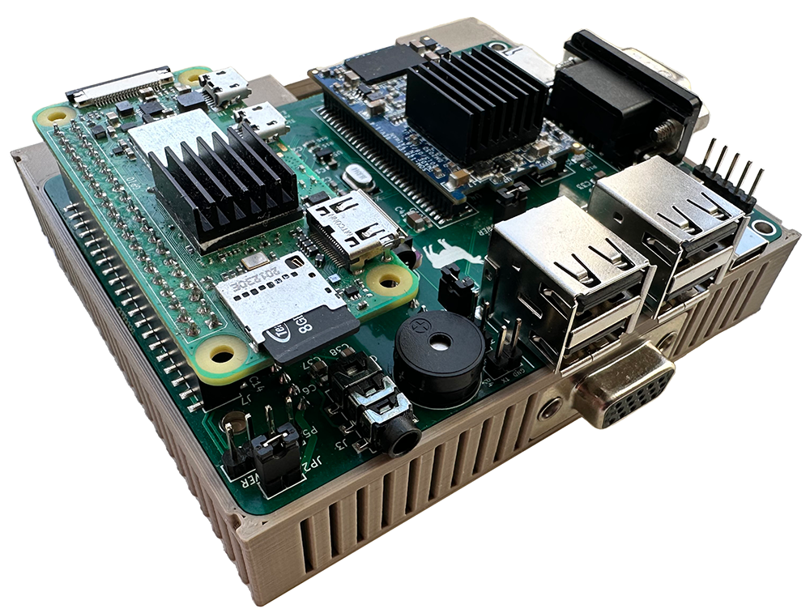

<div id="summary" align="center">
  
</div>

<br/>


<br/>

- A fully-fledged 486/Pentium-class PC in a tiny form factor
- Integrated Sound Blaster Pro-compatible audio
- Add a Raspberry Pi Zero 2 for Roland MT&#8209;32 and General MIDI music
- Open-source hardware schematics, board layout and BIOS - build your own!
- Perfect for playing DOS games!

> **Note**  
> YouTube walkthrough + setup coming soon!

## Table of Contents
- [Summary](#summary)
- [Project Goals](#project-goals)
- [What's New In Version 2?](#whats-new-in-version-2)
- [Full system specs](#full-system-specs-revision-21)
- [Building](#building)
  * [Sourcing Parts](#sourcing-parts)
  * [Assembly](#assembly)
  * [Programming the CH559](#programming-the-ch559)
  * [Programming the BIOS](#programming-the-bios)
  * [Installing DOS](#installing-dos)
  * [Programming the CS4237B Firmware](#programming-the-cs4237b-firmware)
- [WiFi Connectivity](#wifi-connectivity)
- [Wiki](#wiki)
- [Help](#help)
- [Roadmap](#roadmap)
- [Contributing](#contributing)
- [License](#license)
- [Contact](#contact)
- [Acknowledgements](#acknowledgments)

<br/>

<div>


</div>

<br/>

## Project Goals
The goal of the TinyLlama project is:
- To create a fully x86-compatible DIY DOS computer with a sound card
- To keep the size as small as possible while keeping decent connectivity
- To keep the cost low

## What's New In Version 2?
Last year I released [version 1 of the TinyLlama][tinyllama1].  
While I was very happy with it and it worked great, there were a couple of things I felt were still missing + a few bugs.  

The two main new features in version 2 are:
* Built-in hardware USB HID (keyboard+mouse) to PS/2 emulation using [rasteri's HIDman firmware][hidman] running on a CH559 microcontroller  
* On-board Wemos D1 Mini ESP8266 for providing either a Hayes-compatible modem-over-WiFi or ethernet-over-WiFi (SLIP), depending on the firmware on the ESP.

<p>
  
</p>

Both the CH559 and the ESP8266 can be easily re-flashed/programmed in-place.  
Look at [Programming the CH559](#programming-the-ch559) and [Programming the ESP8266][wiki-wifi].

## Full system specs (revision 2.1)
### Hardware
- **86Duino System-on-module**
  * Vortex86EX CPU running at 60-500 MHz
  * 16 KB L1 cache (can be disabled)
  * 128 KB L2 cache
  * 128 MB DDR3 RAM
  * 8 MB programmable flash ROM
- **Vortex86VGA module running off a x1 PCI-e lane**
  * Maximum resolution: 1024x768, 60 Hz
  * 4 MB SRAM
  * [Alternative graphics cards][wiki-alternative-gpus]
- **Crystal CS4237B all-in-one audio chip**
- **12mm PC-speaker**
- **CR1220 battery for persistent real-time clock**
- **Power and reset buttons**
- **Connectivity**
  * USB-C for power
  * 2 x USB Type-A connectors for HID-compliant keyboard and mice
  * 2 x USB Type-A connectors for storage devices (USB 2.0)
  * MicroSD slot for storage
  * DE-9 RS232 serial port (COM1)
  * Modem or Ethernet/SLIP over WiFi (COM2)
  * Internal 2.54mm pin-header for connecting a fan (5V or 3.3V selectable)
  * 3.5mm line-out audio jack
- **mt32-pi subsystem**
  * 40-pin connector for a Raspberry Pi Zero 2
  * Pin headers for attaching a GY-PCM5102 I²S DAC module
  * Button for toggling between MT32 / General MIDI mode
  * Button for switching between audio ROMs / soundbanks
  * 4-pin I²C connector for an OLED display

### Software
- **[Custom Coreboot/SeaBIOS ROM][bios]**
- **MS-DOS / FreeDOS**

<p>
  
</p>

## Building
### Sourcing Parts
Full BOM (bill of materials) can be found [in the wiki][wiki-bom].
- The TinyLlama PCB rev2.1
- Modern SMD and through-hole components, as seen in the BOM
- 86Duino system-on-module (SOM-128-EX)
- Vortex86VGA Mini PCI-e module
- Crystal CS4237B 100-pin TQFP. Discontinued, but readily available
- Wemos D1 Mini ESP8266, optional
- A CR1220 battery if you want a persistent real-time clock
- One or more USB flash drives + an optional microSD card
- A USB-C power adapter (minimum 2A)

#### For MT-32/MIDI - optional
- GY-PCM5102 DAC module
- Raspberry Pi Zero 2 W with a microSD card
- An [mt32-pi compatible OLED display][mt32-pi-oled], optional but nice

### Assembly
Solder all components onto the TinyLlama rev2.1 PCB. As always, it's easier to start with the low-profile ones first, like resistors and capacitors.
If you're willing to spend slightly more, I recommended you let the PCB manufacturer pre-assemble most of the common components for you. Plus, some of the SMD components can be a bit tricky to solder.
Take a look at the [wiki][wiki-assembly] for more in-depth assembly instructions.

### Programming the CH559
1. Download the latest firmware binary from this repo, in the `hidman-binary` folder. Alternatively, get the latest source code from the [official repo][hidman] and compile it yourself.
2. Download and install `WCHISPTool_Setup.exe` from [WCH's website][wch]. Unfortunately, this tool only supports Windows. If you're on macOS or Linux, maybe try using virtualization software, or even another computer.
3. Open the `WCHISPTool_CH54x-55x` application.
4. Make sure the TinyLlama is powered off.
5. **Remove** the jumper from the "HID_POWER" pin header on the PCB (to ensure that the computer doesn't backpower the TinyLlama).
6. Connect a USB cable (type A to type A) between one of the HID USB ports on the TinyLlama and the Windows computer.
7. Press and hold the "PRG" button on the bottom side of the TinyLlama until the CH559 device pops up in the WCHISPTool.
8. Select the firmware binary file under _Download File -> Object File1_.
9. Click the "Download" button. Hopefully you'll get a success message in the log section on the right side of the program window.
10. Disconnect the USB cable.
11. **Add** the jumper to the "HID_POWER" pin header on the PCB.
12. Connect a keyboard to one of the HID USB ports. You should be good to go!

### Programming the BIOS
When purchasing the SOM-128-EX module from DMP, its ROM chip comes preinstalled with an Arduino-like bootloader which is useless to us. Also, the  "crossbar" is configured for using the module with the 86Duino Zero/One boards - meaning its default pin layout is completely different from what we need for the TinyLlama.

Follow these steps to flash the ROM with the TinyLlama BIOS for the first time:
1. Find a USB flash drive, must be minimum 32 MB in size (shouldn't be a problem these days). Note that not all USB drives are bootable. Use a well-known bootable drive. _NB: You have to use a USB stick for this, an SD card won't work since the crossbar is configured to use different pins on the SOM for SD traffic._
2. Unzip the `INITBIOS.ZIP` file from this GitHub repo and do a block-level transfer of the `INITBIOS.IMG` to the USB drive. Use [Balena Etcher][balena-etcher], or the command line if you know what you're doing (macOS example):
```
$ diskutil list
(Find your USB drive, eg. /dev/disk2)
$ diskutil unmountDisk /dev/disk2
$ sudo dd if=INITBIOS.IMG of=/dev/rdisk2 bs=1m
```
3. Insert the USB flash drive into the TinyLlama and turn it on. It'll hopefully boot into MS-DOS. Then, to flash the ROM:
```
C:\>anybios w initbios.rom
```
...and reboot.  

For subsequent BIOS updates, you can use the ROM's built-in virtual floppy drive available from the boot menu (press F12).  
When booted from this you'll only need a regular USB stick (formatted as FAT16/FAT32) containing the new BIOS file.

### Installing MS-DOS
_A note on selecting the DOS type:  
I've gone with MS-DOS 6.22 for maximum compatibility.  
If you prefer FreeDOS (or another DOS variant), prepare a bootable USB installer disk and use that instead of the built-in virtual floppy._
1. Pick a bootable USB drive or Micro SD card to use as the boot drive - for MS-DOS 6.22 you'll be limited to FAT16 and 2 GB per partition (though you can have several). For FreeDOS with FAT32 you can go all the way up to 2 TB.
2. Insert it, turn on the system, press F12 to bring up the boot menu, and select the virtual floppy drive.
3. Use `fdisk` from the command prompt to partition the SD/USB drive and set it to be `Active`.
4. Restart and again select to boot from the virtual floppy.  
Use `format c: /s /u` to format the drive and copy over system files. Finally use `fdisk /mbr` to make sure the Master Boot Record is correct and the drive should be bootable.
5. Copy over the `DOS` folder from A: to C:.  
You can either do this manually and create `CONFIG.SYS` and `AUTOEXEC.BAT` files to your liking, or more conveniently, just run the `SETUP.BAT` script that'll do this for you. The provided config files lets you choose from a clean boot or a QEMM-based one with XMS, EMS and 631 kB of free conventional memory.

### Programming the CS4237B Firmware
1. Copy the `CS4237B` and `UNISOUND` folders from this GitHub repo over to your SD/USB boot drive and start the system.
2. To program the firmware, run the `RESOURCE.EXE` command below and check that you get the same output:
```
C:\>cd cs4237b
C:\CS4237B>resource /f=0x120 /r=cs4237b.asm /e

Reading data from CS4237B.ASM
Length = 292    Programming EEPROM Block: 1 2    EEPROM programmed

Verifying EEPROM:
Verifying CS4237B.ASM against EEPROM . . .      Verified OKAY
```
3. Reboot the system, set the correct `BLASTER` environment variable and run `UNISOUND.EXE`; you should get the following output:
```
C:\>set BLASTER=A220 I7 D1 P330 T4
C:\>cd unisound
C:\UNISOUND>unisound
Universal ISA PnP Sound Card Driver for DOS v0.76f. (c) JazeFox 2019-21
-----------------------------------------------------------------------
PnP card found: [CSC7537] CS4237B
BLASTER environment var found! Loading settings...
ADD:220 WSS:534 OPL:388 IRQ:7 DMA:1/1 MPU:330/I9 CTR:120 JOY:200
Initialization done.
Crystal Mixer [VOL:85 WAV:80 FM:80 LIN:0 CD:0 MIC:0]
```
4. If everything went ok, add the `BLASTER` variable and `UNISOUND` command to your `AUTOEXEC.BAT` file:
```
SET BLASTER=A220 I7 D1 P330 T4
C:\UNISOUND\UNISOUND.EXE /V60 /VW60 /VF60 /VL60 /VP60 /VC0 /VM0
```
5. Feel free to experiment with the different volume levels, look at the `C:\UNISOUND\UNISOUND.TXT` file for further guidance.
6. Fire up a few games to test that Adlib, SoundBlaster FM and digital sound effects are working properly.

## WiFi Connectivity
There's a [section][wiki-wifi] in the wiki dedicated to this, take a look.

## Wiki
For an in-depth discussion of the various components, installation, configuration, etc, take a look at the [wiki][wiki].

## Help
This project is indended for people with a fair bit of hardware- and DOS knowledge. If you have questions or need help, please look at the [wiki][wiki] and [FAQ][wiki-faq] section first.

## Roadmap
Coming.  
In the mean time feel free to post [an issue][issues] if you have tips, suggestions or want to report an error.

## License
[GNU General Public License v3.0](LICENSE)

## Contact
Development thread: [Vogons][vogons-thread]  
Mastodon: [@eivindbohler@techhub.social][mastodon]  
Twitter: [@eivindbohler][twitter]  
YouTube: [@eivindbohler][youtube]

## Acknowledgements

Many thanks to
- [Sergey Kiselev][sergeys-projects] for sparking my interest in designing and building computers.
- [Rasteri][rasteri-videos] for introducing me to the CS4237B chip.
- [The Vogons forum][vogons] for inspiration, help and support.
- [86Duino / DMP][86duino] for making a great and affordable system-on-module.
- [Dale Whinham / mt32-pi][mt32-pi] for making the best synth emulator software.

[tinyllama1]: https://github.com/eivindbohler/tinyllama
[hidman]: https://github.com/rasteri/HIDman
[wiki-alternative-gpus]: https://github.com/eivindbohler/tinyllama2/wiki/alternative-gpus
[bios]: https://github.com/eivindbohler/tinyllama2-bios

[wiki]: https://github.com/eivindbohler/tinyllama2/wiki
[wiki-assembly]: https://github.com/eivindbohler/tinyllama2/wiki/assembly
[wiki-bom]: https://github.com/eivindbohler/tinyllama2/wiki/bom
[wiki-faq]: https://github.com/eivindbohler/tinyllama2/wiki/faq
[wiki-wifi]: https://github.com/eivindbohler/tinyllama2/wiki/wifi-connectivity

[balena-etcher]: https://www.balena.io/etcher
[mt32-pi-oled]: https://github.com/dwhinham/mt32-pi/wiki/LCD-and-OLED-display
[wch]: http://www.wch-ic.com/products/CH559.html

[issues]: https://github.com/eivindbohler/tinyllama2/issues

[vogons-thread]: https://www.vogons.org/viewtopic.php?t=84880
[mastodon]: https://techhub.social/@eivindbohler
[twitter]: https://twitter.com/eivindbohler
[youtube]: https://youtube.com/@eivindbohler

[sergeys-projects]: http://www.malinov.com/Home/sergeys-projects
[rasteri-videos]: https://www.youtube.com/user/TheRasteri/videos
[vogons]: https://www.vogons.org
[86duino]: https://www.86duino.com
[mt32-pi]: https://github.com/dwhinham/mt32-pi